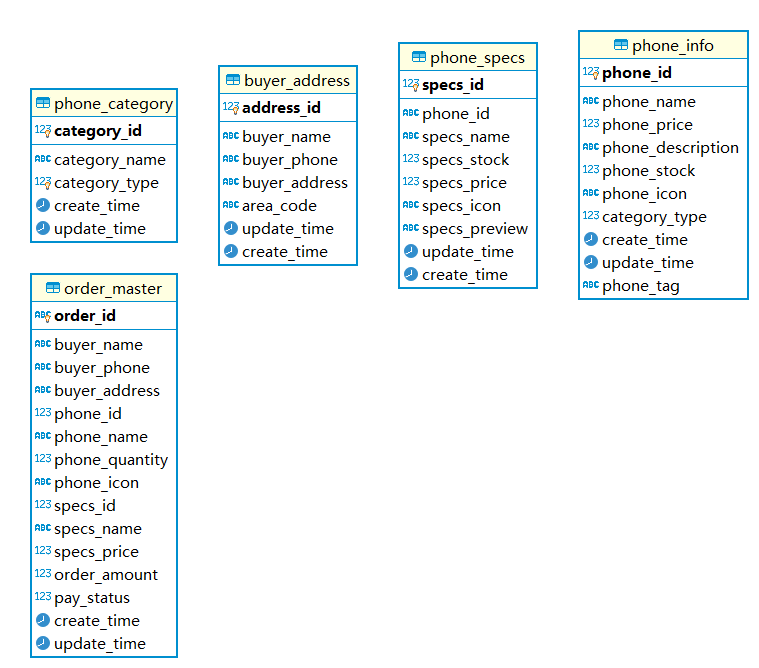

# A Phone Store application built with Spring Boot
This is the backend part of a phone store application built 
with Spring Boot as the backend and vue as the frontend.
It's a demo project but runnable.

The front end part is [here](https://github.com/YuuyWei/phone_store_demo_vue)

## Screenshots
.jpeg)
.jpeg)
.jpeg)
.jpeg)
.jpeg)
.jpeg)

## Requirement of Business
There are three associated part in the business including:
- the presenting and classifying of phones
- the adding and updating of users' addresses
- the creating and paying of orders

## the Database
The demo project uses MySQL 8.0.22,
[Here](phone_store.sql) is the SQL file.

## RESTful API
[Here]() is the API file.

## Part of Backend
The backend part is mainly constructed with Spring Boot including
Spring MVC, Spring Data JPA, MySQL as the DBMS and Gradle as the
building tools.